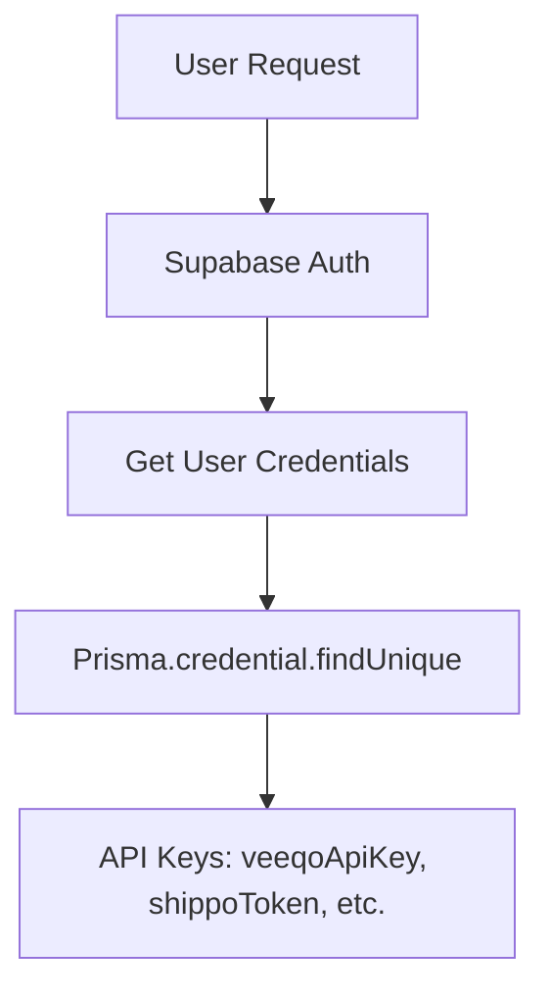
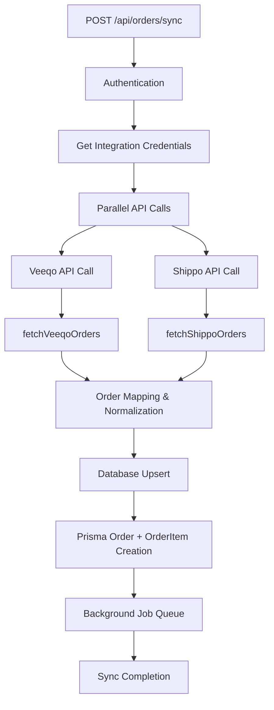
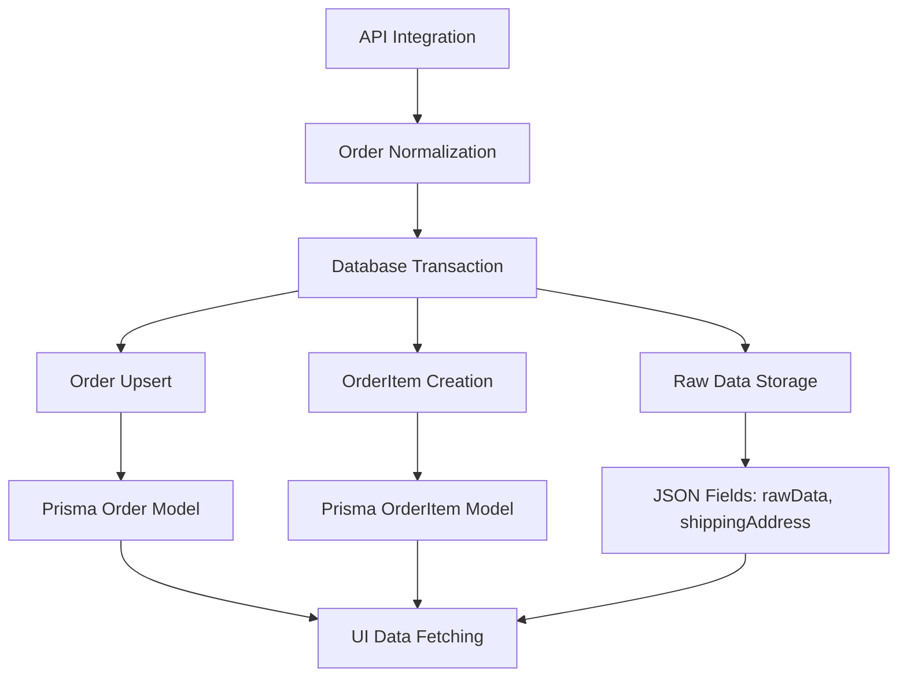
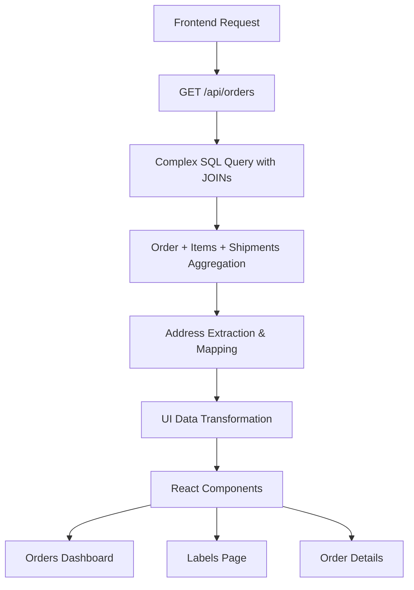
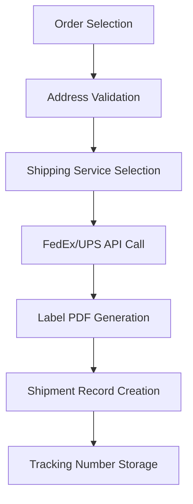
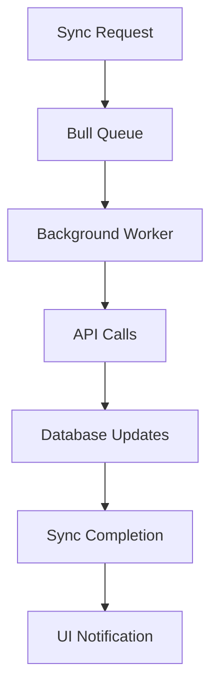

# Marketplace Integration Flow Architecture

## Overview
This document maps the current marketplace integration architecture to understand how Veeqo and Shippo orders flow through the system. This analysis will guide the Trendyol integration implementation.

## Current Marketplace Ecosystem

### Supported Marketplaces
- **Veeqo**: Direct API integration for multi-marketplace order management
- **Shippo**: Direct API integration for shipping and order management
- **Hepsiburada**: Database credentials configured (partial implementation)
- **Trendyol**: Database credentials configured (ready for implementation)

### Data Models
```typescript
// Core data types
type OrderChannel = 'etsy' | 'shopify' | 'amazon' | 'ebay' | 'other';
type OrderSource = 'veeqo' | 'shippo' | 'trendyol' | 'hepsiburada';

// Database models
- Order: marketplace, marketplaceKey, orderNumber, rawData
- OrderItem: sku, productName, quantity, unitPrice, weightKg
- Credential: veeqoApiKey, shippoToken, trendyolApiKey, etc.
- MarketplaceConfig: user-specific marketplace configurations
```

## Request → Service → Database → UI Flow

### 1. Authentication & Configuration


### 2. Order Sync Flow (Primary Path)


### 3. Detailed API Integration Points

#### Veeqo Integration
```
API: https://api.veeqo.com/orders
Headers: { 'x-api-key': veeqoApiKey }
Pagination: page, page_size parameters
Filtering: status, updated_at_min parameters

Data Mapping:
- Order: id → marketplaceKey, number → orderNumber
- Items: line_items → OrderItem array
- Address: deliver_to → shippingAddress JSON
```

#### Shippo Integration
```
API: https://api.goshippo.com/orders/
Headers: { 'Authorization': `ShippoToken ${token}` }
Pagination: page, results parameters

Data Mapping:
- Order: order_number → marketplaceKey
- Items: line_items → OrderItem array
- Address: to_address → shippingAddress JSON
```

### 4. Database Layer Architecture


### 5. UI Data Flow


## Key Integration Patterns

### 1. Credential Management
- **Database Storage**: User-specific API keys stored in `Credential` table
- **Environment Fallback**: Global API keys for system-wide operations
- **Security**: No API keys in frontend, server-side only

### 2. Order Synchronization
- **Incremental Sync**: `updated_at_min` parameter for efficient updates
- **Full Sync**: Complete order history download
- **Deduplication**: Unique constraint on `userId + marketplace + marketplaceKey`

### 3. Data Normalization
- **Marketplace Agnostic**: Common Order/OrderItem schema
- **Raw Data Preservation**: Original API responses stored in JSON fields
- **Address Standardization**: Consistent shipping address format

### 4. Error Handling & Monitoring
- **Retry Logic**: Exponential backoff for API failures
- **Sync Operations**: Database tracking of sync status and metrics
- **Logging**: Comprehensive error logging with context

## Shared Service Helpers

### 1. Order Sync (`lib/orderSync.ts`)
```typescript
- syncAllOrders(): Main orchestrator
- determineChannel(): Maps marketplace to channel
- Handles both Veeqo and Shippo order processing
```

### 2. Integration Clients (`lib/integrations/`)
```typescript
- fetchVeeqoOrders(): Paginated Veeqo API client
- fetchShippoOrders(): Paginated Shippo API client
- Error handling and rate limiting
```

### 3. Configuration Management (`lib/config.ts`)
```typescript
- getIntegrationCreds(): Database credential retrieval
- Environment variable management
- Feature flag support
```

### 4. Database Operations (`lib/prisma.ts`)
```typescript
- Order/OrderItem upsert logic
- Transaction management
- Complex query building
```

## Label Generation Flow


## Background Job Architecture


## API Endpoints Summary

### Order Management
- `POST /api/orders/sync` - Main sync endpoint
- `GET /api/orders` - Paginated order listing with complex filtering
- `GET /api/orders/[orderId]` - Single order details
- `PATCH /api/orders/[orderId]` - Update order details
- `POST /api/orders/[orderId]/resync` - Resync specific order

### Label Operations
- `POST /api/orders/labelSync` - Label-specific sync
- `POST /api/orders/[orderId]/generate-label` - Generate shipping label
- `POST /api/labels/ups` - UPS label generation
- `POST /api/labels/fedex` - FedEx label generation

## Trendyol Integration Requirements

Based on this analysis, Trendyol integration should follow these patterns:

### 1. Database Schema
- ✅ Trendyol credentials already in `Credential` table
- ✅ Order/OrderItem models support any marketplace
- ✅ Unique constraint supports new marketplace

### 2. API Client (`lib/integrations/trendyol.ts`)
```typescript
- fetchTrendyolOrders(): Follow Veeqo/Shippo patterns
- Authentication: Supplier ID + API Key + Secret
- Pagination: Match Trendyol API specifications
- Error handling: Consistent with existing clients
```

### 3. Data Mapping
```typescript
- Order: Trendyol order ID → marketplaceKey
- Items: Trendyol line items → OrderItem array
- Address: Domestic Turkish addresses → shippingAddress JSON
- Status: Trendyol status → Order.status mapping
```

### 4. Feature Flag Integration
```typescript
- MARKETPLACE_TRENDYOL environment variable
- isTrendyolEnabled() helper function
- Conditional API calls and UI display
```

### 5. UI Integration
- Add "Trendyol" to marketplace filter dropdown
- Display Trendyol badge in order listings
- Handle domestic shipping limitations in label generation

## Key Findings for Trendyol Integration

### ✅ Reusable Components
- Order sync pipeline (`syncAllOrders`)
- Database transaction patterns
- UI data transformation logic
- Error handling and retry mechanisms

### ✅ Existing Infrastructure
- Authentication and credential management
- Background job processing
- Pagination and filtering systems
- Label generation framework (for future Turkish carriers)

### ⚠️ Trendyol-Specific Considerations
- Domestic shipping only (no international)
- Turkish address format validation
- Future integration with Turkish cargo companies
- API rate limiting and authentication requirements

This architecture provides a solid foundation for implementing Trendyol integration by following established patterns while accommodating Trendyol's specific requirements. 